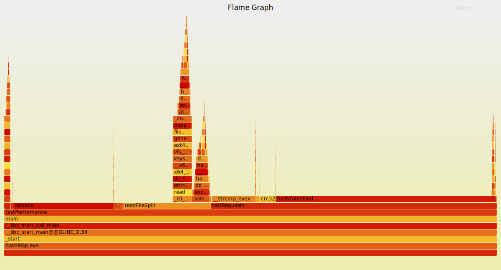
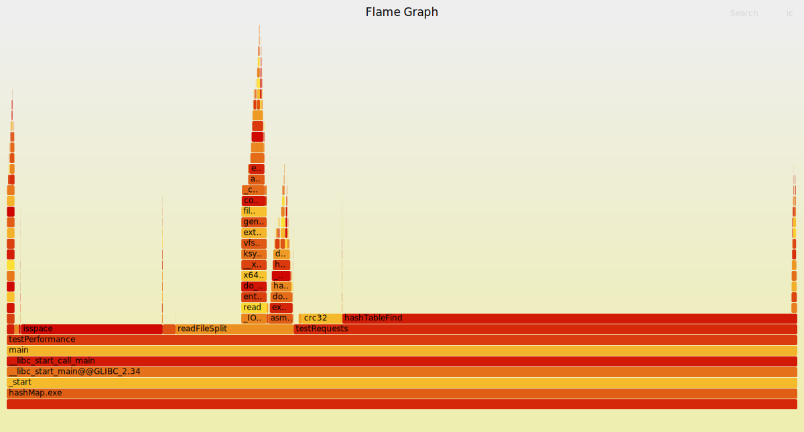
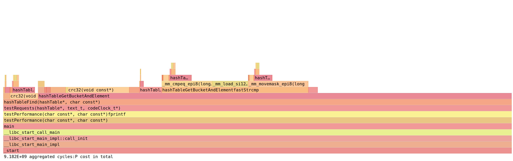
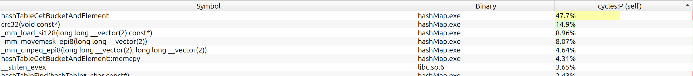

# Hash table

Implementation of associative array with string keys in C using hash table. Optimized with SIMD and asm.

## Compiling

```bash
    git clone -b v2 https://github.com/orientiered/HashTable.git
    cd HashTable
    make BUILD=RELEASE
```

If you use clangd, run `make compile_commands`.

## Hash functions

Built-in hash functions:

+ `checksum` - sum of ascii codes
+ `djb2` - simple and fast hashing algorithm
+ `crc32` - used by default

You may pass your own hash function. Requirments:

+ `hash_t your_hash(const void *ptr);`
+ `ptr` is pointer to the start of C-string (may change later)

## Testing conditions

Test device: Lenovo XiaoXin X16 Pro (2024)

CPU: AMD Ryzen 7 8845H w/ Radeon 780M Graphics 3.80 GHz (8 cores, 16 threads)

Compilers:

g++ 13.3.0
OS: Linux Mint 22.1 x86_64

To test performance i will use ["The Complete Works of William Shakespeare"](https://www.gutenberg.org/cache/epub/100/pg100.txt). [File](shakespeare.txt)

1.`testString.txt`: all words are split by lines and everything except letters is removed.
2.`testRequests.txt`: search requests for hash table. Consist of 100 millions lines (approx 500mb), 90% of which are lines from `testString.txt` and other 10% are random gibberish with length of 3 to 14 letters.

You could create these files by running `make test_file`. There are options `TESTS`(100 millions by default) and `FOUND_PERCENT` (0.9 by default) that you can tweak.

Test is done by running `./hasMap.exe`. Program processes test files and measures time that was spent doing requests from `testRequests.txt`.

Additional info: optimal load factor for hash table is about 2. However i will use load factor 15-17 to increase execution time and see the difference better.

## Optimization

### No optimizations, -O0 + asserts

Program took 15.7 seconds to process requests.

### No optimizations, -O3

14.2 seconds execution time.

Let's find what bottlenecks performance. I will use `perf` with `flamegraph`.

```
+   44,18%  libc.so.6     [.] __strcmp_evex
+   16,88%  hashMap.exe   [.] hashTableFind(hashTable*, char const*)
+    7,27%  hashMap.exe   [.] strcmp@plt
+    4,26%  hashMap.exe   [.] crc32(void const*)
+    0,73%  hashMap.exe   [.] testRequests(hashTable*, text_t, codeClock_t*)
// calls below are not from the main test
+    9,65%  hashMap.exe   [.] readFileSplit(char const*)
+    7,82%  libc.so.6     [.] isspace
+    3,25%  hashMap.exe   [.] isspace@plt
```


Most part of the time takes strcmp, search function and crc32.

We will start optimizations with strcmp. Most of the words are shorter than 32 letters, so we can use SIMD instructions to compare short strings faster. To make things easier, i will add field with length of the string.

### Strcmp optimization

Changes:

+ `aligned_alloc` instead of `calloc` to ensure correct alignment for SIMD
+ When you know lengths of the strings, you could first check them on equality. This optimization is more algorithimic but it will be stupid not to implement it.
+ New hashTableFind algorithm:
    First length of the key is calculated. If it is more than `SMALL_STR_LEN` (32 chars), than previous implementation is used. Core of new implementation can be seen below:

    ```c
    if (keyLen >= SMALL_STR_LEN) {
        // previous version
        while (node) {
            if (node->len == keyLen && strcmp(node->key, key) == 0 )
                return node->value;

            node = node->next;
        }

    } else {
        // new version
        alignas(KEY_ALIGNMENT) char keyCopy[SMALL_STR_LEN] = "";
        memcpy(keyCopy, key, keyLen+1);
        MMi_t searchKey = _MM_LOAD((MMi_t *) keyCopy);

        while (node) {
            if (node->len == keyLen && fastStrcmp(searchKey, (MMi_t *) node->key) == 0)
                return node->value;

            node = node->next;

        }

    }
    ```

    Where `fastStrcmp` is

    ```c
    static int fastStrcmp(MMi_t a, MMi_t *bptr) {
        MMi_t b = _MM_LOAD(bptr);
        uint32_t cmpMask = (uint32_t) _MM_CMP_MOVEMASK(a, b); //k-th bit = (a[k] == b[k])
        //_MM_MASK_CONSTANT is 0xFFFF for SSE and 0xFFFFFFFFF for AVX2
        return (int) (cmpMask ^ _MM_MASK_CONSTANT); 
    }
    ```

Comparing length of the string first:

Execution time: 10.45 seconds.


Only fastStrcmp, without `CMP_LEN_FIRST'

Execution time: 11.6 seconds


Both strcmp optimizations:

Execution time: 10.15 seconds (AVX2)


Most strings are shorter than 16 characters. It means that we can use SSE instructions to compare strings and in theory it could be faster, because less memory needs to be loaded.

Both strcmp optimizations and SSE SIMD:

Execution time: 9.23 seconds





`CRC32` takes almost 15% of computing time. This hashing algorithm is so widely used, that CPU's have dedicated instruction to calculate it: `crc32`.
