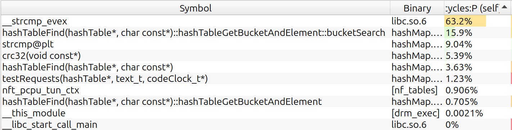
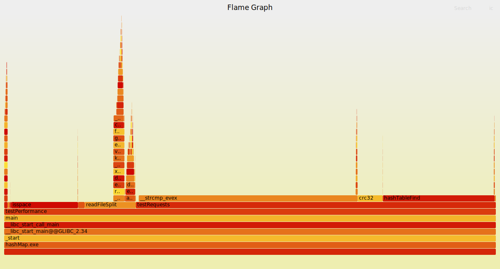
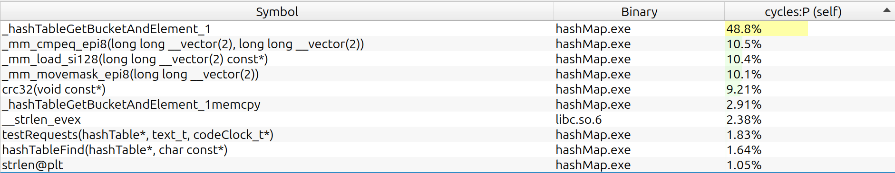
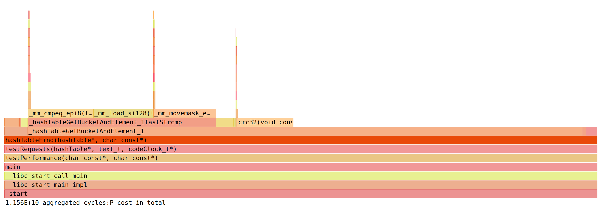
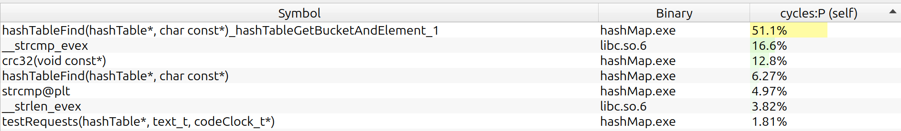
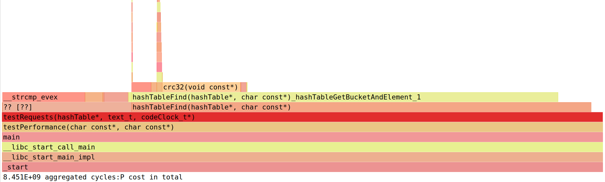
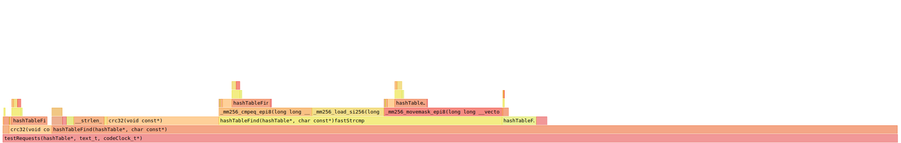
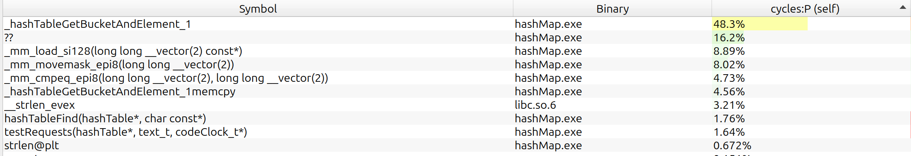
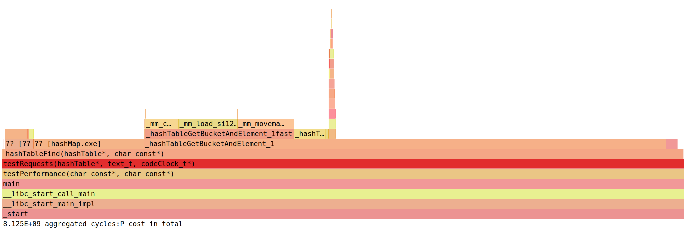

# Hash table

Implementation of associative array with string keys in C using hash table. Optimized with SIMD and asm.

## Compiling

```bash
    git clone -b v2 https://github.com/orientiered/HashTable.git
    cd HashTable
    make BUILD=RELEASE
```

If you use clangd, run `make compile_commands`.

## Hash functions

Built-in hash functions:

+ `checksum` - sum of ascii codes
+ `djb2` - simple and fast hashing algorithm
+ `crc32` - used by default

You use your own hash function specify it in `include/hashTable.h` in `#define _HASH_FUNC`. Requirments for hash function:

+ `hash_t your_hash(const void *ptr);`
+ `ptr` is pointer to the start of C-string (may change later)

## Testing conditions

Test device: Lenovo XiaoXin X16 Pro (2024)

CPU: AMD Ryzen 7 8845H w/ Radeon 780M Graphics 3.80 GHz (8 cores, 16 threads)

Compilers:

g++ 13.3.0
OS: Linux Mint 22.1 x86_64

To test performance i will use ["The Complete Works of William Shakespeare"](https://www.gutenberg.org/cache/epub/100/pg100.txt). [File](shakespeare.txt)

1.`testString.txt`: all words are split by lines and everything except letters is removed.
2.`testRequests.txt`: search requests for hash table. Consist of 10 millions lines (approx 50mb), 90% of which are lines from `testString.txt` and other 10% are random gibberish with length of 3 to 14 letters. This file is processed 10 times.

You could create these files by running `make test_file`. There are options `TESTS`(100 millions by default) and `FOUND_PERCENT` (0.9 by default) that you can tweak.

Test is done by running `./hasMap.exe`. Program processes test files and measures time that was spent doing requests from `testRequests.txt`.

Additional info: optimal load factor for hash table is about 2. However i will use load factor 15-17 to increase execution time and see the difference better. (in educational purposes)

## Optimization

__All programs were compiled in release version__

### No optimizations, -O0

Program took 15.7 seconds to process requests.

### No optimizations, -O3 

13.9 seconds execution time, approx. 53 * 10^9 clock cycles

Let's find what bottlenecks performance. I will use `perf` profiling tool with `hotspot` and `flamegraph`.





Most part of the time takes strcmp, search function and crc32.

We will start optimizations with strcmp. Most of the words are shorter than 16 letters, so we can use SIMD instructions to compare short strings faster. In order to find short strings faster, i will add field with length of the string.

### Strcmp optimization

Changes:

+ `aligned_alloc` instead of `calloc` to ensure correct alignment for SIMD
+ When you know lengths of the strings, you could first check them on equality. This optimization is more algorithimic but it will be stupid not to implement it. This optimization is enabled with `#define CMP_LEN_FIRST`.
+ New hashTableFind algorithm:
    Length of the key is calculated first. If it is more than `SMALL_STR_LEN` (16 chars), than previous implementation is used. This optimization can be enabled with `#define FAST_STRCMP` Core of new implementation can be seen below:

    ```c
    if (keyLen >= SMALL_STR_LEN) {
        // Key doesn't fit in SIMD register
        while (node) {
            if (CMP_LEN_OPT(node->len == keyLen &&) strcmp(node->key, key) == 0 )
                return node;

            node = node->next;
        }

    } else {
        // Creating local aligned array of chars for key
        alignas(KEY_ALIGNMENT) char keyCopy[SMALL_STR_LEN] = "";
        // Copying key to it
        memcpy(keyCopy, key, keyLen+1);
        // Loading key to SIMD register
        MMi_t searchKey = _MM_LOAD((MMi_t *) keyCopy);

        while (node) {
            if (CMP_LEN_OPT(node->len == keyLen &&) 
                //! Alignment of key is guaranteed by aligned_calloc with KEY_ALIGNMENT
                fastStrcmp(searchKey, (MMi_t *) node->key) == 0)
                return node;

            node = node->next;

        }
    }
    ```

    Where `fastStrcmp` is

    ```c
    typedef __m128i MMi_t;
    #define _MM_LOAD(ptr) _mm_load_si128(ptr)
    #define _MM_CMP_MOVEMASK(a, b) _mm_movemask_epi8(_mm_cmpeq_epi8(a, b))
    static const uint32_t _MM_MASK_CONSTANT = 0xFFFF;
    static int fastStrcmp(MMi_t a, MMi_t *bptr) {
        MMi_t b = _MM_LOAD(bptr);
        //k-th bit of cmpMask = (a[k] == b[k])
        uint32_t cmpMask = (uint32_t) _MM_CMP_MOVEMASK(a, b); 
        //_MM_MASK_CONSTANT is 0xFFFF for SSE and 0xFFFFFFFFF for AVX2
        return (int) (cmpMask ^ _MM_MASK_CONSTANT); 
    }
    ```

### Only fastStrcmp, without `CMP_LEN_FIRST'

Execution time: 11.0 seconds, approx. 42 * 10^9 clock cycles.



Now strcmp takes approx. 30% of computing time - great improvement.

### Comparing length of the string first, without `FAST_STRCMP`

Execution time: 10.4 seconds, 39.5 * 10^9 clock cycles.



In that case algorithimic optimization yields better result, is not hardware specific and can be implemented easier.

### Both strcmp optimizations (`CMP_LEN_FIRST` + `FAST_STRCMP`)

Execution time: 9.5 seconds, 36 * 10^9 clock cycles.



These optimizations work well together.

### Crc32 written in asm

`CRC32` takes almost 15% of computing time. This hashing algorithm is so widely used, that CPU's have dedicated instruction to calculate it: `crc32`.

```asm
;========================================================
; Crc32 hashing algorithm for C strings
; Args:
;   rdi - memory address
; Ret:
;   rax - crc32 hash
;========================================================
fastCrc32u:
    xor  rax, rax
    dec  rax        ; rax = all ones
    .hash_loop:
        mov   sil, BYTE [rdi]
        inc   rdi
        crc32 rax, sil
        test  sil, sil
        jnz   .hash_loop

    ret
```

Execution time: 9.2 seconds, 34.9 * 10^9 clock cycles





Program now works faster, but hashing function takes more cycles. Probable explanation: `crc32` uses different polynom, which has better distribution. On my test file dispersion of elements in bucket decreased from 4.03 to 3.93.
