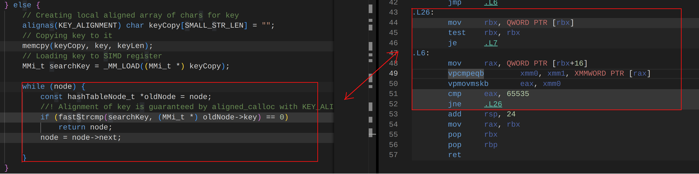
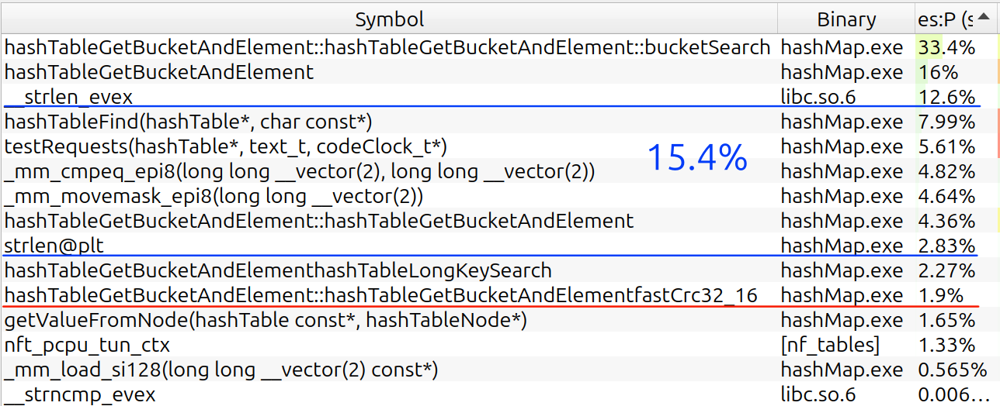

# Hash table / Хеш-таблица

English version (outdated): [README_en.md](README_en.md)

Ассоциативный массив на основе [хеш-таблицы](https://ru.wikipedia.org/wiki/Хеш-таблица) со строками в качестве ключей.

Проект является лабораторной работой по оптимизации хеш-таблицы со способом разрешения коллизий методом цепочек  для x86_64 с использованием различных аппаратнозависимых оптимизаций: написание функций на [ассемблере](source/crc32.s) и использование inline ассемблера для оптимизации функции хеширования, интринсиков для ускорения функции сравнения строк, а также изменение метода хранения данных для лучшего использования кеша.

В результате время 100 млн поисков удалось уменьшить с 16.7 +- 0.1 секунд до 2.195+-0.005 секунд. (Ускорение в 7.6+-0.1 раз).

## Что оптимизируем?

Сценарий использования хеш-таблицы является определяющим фактором для направления оптимизаций. Иногда необходимо быстро добавлять и удалять элементы, иногда искать, а может и всё сразу.

В данной работе было принято решение оптимизировать функцию поиска элемента в таблице по его ключу. При этом операция добавления элемента также заметно ускорится, ведь одна из её частей - проверка на то, что элемента нет в таблице, т.е. его поиск.  

**Примечание**: на данный момент операция удаления не поддерживается

Сценарий использования будет следующим: посчитать частоты только тех слов из файла 2, которые есть в файле 1. Предполагается, что файл 1 много меньше файла 2. Из этого следует, что число операций вставки на несколько порядков меньше числа операций поиска. Кроме того предлолагается, что большинство слов короткие (меньше 16 символов), что близко к правде для человеческих языков (по разным [источникам](https://qna.habr.com/q/554389) в русском языке средняя длина слова порядка 6.5 букв, в английском 5.5 букв).

## Компиляция

```bash
    git clone -b new_arch https://github.com/orientiered/HashTable.git
    cd HashTable
    make BUILD=RELEASE
```

Для генерации конфига `clangd`, используйте `make compile_commands`.

## Хеш-функции

Есть несколько встроенных хеш-функций (все они написаны для работы с C-строками):

+ `checksum` - сумма ascii кодов букв строки
+ `djb2` - простой и достаточно быстрый алгоритм хеширования
+ `crc32` - очень популярный алгоритм хеширования, за основу взята версия с таблицей предпосчитанных значений

Теоретически можно использовать свою хеш-функцию, указав её в `include/hashTable.h` в `#define _HASH_FUNC`.

При этом она должна иметь следующий вид:

+ `hash_t your_hash(const void *ptr);`
+ `ptr` - указатель на начало C-строки

### Анализ распределения хеш-функций

Для эффективной работы таблицы элементы должны быть равномерно распределены по бакетам. Для оценки распределения есть функция `hashTableCalcDistribution`, которая считает дисперсию количества элементов в бакетах и строит в консоли график распределения размера бакета по номеру бакета.

| хеш   | Дисперсия |
|-------|-----------|
| checksum  | 24.58 |
| djb2  | 8.98      |
| crc32 | 4.03      |

Посмотрим на гистограмму распределения размера по количеству бакетов с таким размером:

| Checksum | Djb2 |
|----------|------|
| |  |


Если хеш-функция действительно случайна (здесь за случайную величину принимаем индикатор того, что элемент попал в бакет с фиксированным номером), то, согласно центральной предельной теореме, сумма большого числа таких событий (= размер бакета) будет стремиться к нормальному распределению.

Гистограмма `checksum` представляет собой непонятно что, `djb2` выглядит немного похожим на Гауссово распределение, но всё ещё далёк от него.

Гистограмма `crc32` довольна близка к нормальному распределению, причём её максимум (16) совпадает с мат. ожиданием (16.4). Её дисперсия известна, поэтому можно сделать оценку: 67% бакетов имеют длину от 12 до 20 элементов.

## Методика тестирования

Машина: Lenovo XiaoXin X16 Pro (2024)

CPU: AMD Ryzen 7 8845H w/ Radeon 780M Graphics 3.80 GHz (8 cores, 16 threads)

Компилятор: g++ 13.3.0

OS: Linux Mint 22.1 x86_64

### Тестовые файлы

Указанные в сценарии использования файлы 1 и 2 будут сгенерированы из [полного собрания сочинений Шекспира](https://www.gutenberg.org/cache/epub/100/pg100.txt). [Файл](shakespeare.txt)

1.`testString.txt`: текст разделяется на слова, всё остальное убирается. Слова расположены по одному на строке. Всего примерно 25 тысяч уникальных слов.

2.`testRequests.txt`: набор из 10 миллионов слов (порядка 50МБ), 90% взяты из `testString.txt`, остальные сгенерированы рандомно с длиной от 3 до 14 символов.

Файл 2 обрабатывается `TEST_LOOPS` раз, по умолчанию 10.

Эти файлы генерируются при помощи команды `make test_file`. Можно поменять количество тестов при помощи `TESTS`(10 миллионов по умолчанию) и часть слов, взятых из файла 1 - `FOUND_PERCENT` (0.9 по умолчанию).

### Измерение времени

Для измерения времени использовались ~~14 индусов с секундомерами~~ `clock_gettime` в режиме `CLOCK_PROCESS_CPUTIME_ID` и `_rdtsc`. `_rdtsc` возвращает текущее количество тактов процессора, обладает большей точностью и меньшими накладными расходами, но поскольку время теста порядка 5-10 секунд, особо смысла в ней нет: гораздо большую погрешность вносит операционная система. Тем не менее его полезно использовать для оценки количества тактов, которые тратятся на один вызов.

Поскольку оптимизируется функция поиска, то наибольший интерес представляет время, проведенное в цикле подсчёта слов из файла 2. Время, затраченное на подготовку данных и загрузку слов из файла 1 в таблицу, не учитывается, так как это уже совсем другая задача.

### О погрешностях

Для оценки погрешности будем запускать тест 6 раз подряд.

Первый результат отбрасывается, от остальных пяти берётся среднее, в качестве погрешности берём среднеквадратичное отклонение:

```math
    \sigma_t = \sqrt{\frac{N}{N-1}} * \sqrt{\overline{t^2} - \overline{t}^2 }
```

(первый множитель - поправка, связанная с малым количеством измерений)

### Запуск теста

`make run`.

Программа пересобирается в релизную версию и запускается на 1 ядре суммарно 6 раз при помощи команды `taskset 0x1`.

Во время тестов все программы закрыты, кроме текстового редактора VSCode.

### Троттлинг

Его нет. Тест достаточно короткий (около 10 секунд), поэтому процессор не успевает нагреться выше 60 градусов.

### Важно: Load factor

Load factor - среднее количество элементов в бакете таблицы. Оптимальным значением является 1.5-2 для таблиц на основе списков и 0.75 для хеш-таблиц на основе открытой адресации (в java 0.75), но в учебных целях таблица строится с заведомо большим коэффициентом "заполненности": 15-17. Это сделано для того, чтобы было проще увидеть части, которые занимают много времени при исполнении. В конце будет проведено сравнение с правильной "настройкой" хеш-таблицы.

## Ход работы: оптимизации

Структура первой версии:

+ Память для ключей и значений выделяется при помощи `calloc` (простая наивная реализация)
+ В бакетах элементы хранятся в виде списка (**не массив**), ноды выделяются при помощи `calloc`
+ О длинах строк ничего не известно

### Тесты первой версии

(Odefault - компиляция без ключей оптимизации)

| Версия   | Время, с       | Время одного запроса, тактов |
|-------   |----            |-----                         |
| Odefault | 16.7  +- 0.1   | 634 +- 4                     |
| -O3      | 14.9  +- 0.1   | 566 +- 4                     |

Для профилирования программы будем использовать утилиту `perf` и программу `hotspot` для анализа полученного профиля.

Иногда будут встречаться т.н. `flamegraph`ы - визуализация стека вызовов, отражающая время исполнения каждой функции.

Для запуска профилирования есть команда `make perfTest` - она компилирует релизную версию с флагом `-fno-omit-frame-pointer`, который делает обязательным сохранение rbp в функциях (без этого perf может неправильно интерпретировать stack trace и пропускать названия функций). 

Затем запускает профилирование c флагами `-g` (записать трейс стека) и `--call-graph dwarf`. Частота выборок по умолчанию 10000 Гц, но её можно поменять при помощи опции `FREQ`. **Примечание**: реальная частота снэпшотов perf может отличаться.

#### Профиль 1

При помощи `hotspot` рассмотрим наиболее горячие функции.


(реальная частота 7.585KHz, примерно такие же частоты будут и на других тестах)

Отсортируем их по собственному времени. Видно, что наиболее ресурсоёмкой оказалась функция сравнения строк, а точнее `__strcmp_evex` - уже оптимизированная под AVX512 функция сравнения строк. Следующие кандидаты - функция поиска в списке и подсчёт хеша.

### Оптимизация strcmp

Как мы выяснили раньше, первым кандидатом на оптимизацию является `strcmp`. Несмотря на то, что библиотечная версия уже оптимизирована с применением SIMD, она ничего не знает о выравнивании и длине строк. Поэтому можно хранить ключи в таблице с выравниванием `KEY_ALIGNMENT`, и, возможно, длину ключей. Перейдём непосредственно к реализации.

+ `aligned_alloc` вместо `calloc` создаст необходимое выравнивание для строк, чтобы их можно было быстро загрузить в SIMD регистр.
+ Байты после конца строки нулевые до конца выравненного блока. Это позволит не беспокоиться о том, что в SIMD регистр попадёт часть другой строки или вообще чужая память.
+ Если известна длина строки, то логично сначала сравнить её. Несмотря на то, что это алгоритмическая оптимизация, не добавлять её довольно глупо. Она может быть включена при помощи `#define CMP_LEN_FIRST`.
+ Оптимизированный `fastStrcmp`:

    ```c
    typedef __m128i MMi_t;
    #define _MM_LOAD(ptr) _mm_load_si128(ptr)
    #define _MM_CMP_MOVEMASK(a, b) _mm_movemask_epi8(_mm_cmpeq_epi8(a, b))
    static const uint32_t _MM_MASK_CONSTANT = 0xFFFF;

    static int fastStrcmp(MMi_t a, MMi_t *bptr) {
        MMi_t b = _MM_LOAD(bptr);
        //k-th bit of cmpMask = (a[k] == b[k])
        uint32_t cmpMask = (uint32_t) _MM_CMP_MOVEMASK(a, b); 
        //_MM_MASK_CONSTANT is 0xFFFF for SSE and 0xFFFFFFFFF for AVX2
        return (int) (cmpMask ^ _MM_MASK_CONSTANT); 
    }
    ```

    В SSE4.2 есть специализированные инструкции для сравнения строк, но у них [задержка](https://www.laruence.com/sse/) минимум в 10 тактов, в то время как комбинация `cmpeq` и `movemask` требует суммарно 3 такта.

    Кроме того, эта функция предполагает, что ключ был загружен в SIMD регистр. Посмотрим, как это делается:

    ```c
    /// Part of the bucketSearch function
    keyLen = strlen(key);

    if (keyLen >= SMALL_STR_LEN) {
        // Key doesn't fit in SIMD register
        while (node) {
            if (CMP_LEN_OPT(node->len == keyLen &&) strcmp(node->key, key) == 0 )
                return node;

            node = node->next;
        }

    } else {
        // Creating local aligned array of chars for key
        alignas(KEY_ALIGNMENT) char keyCopy[SMALL_STR_LEN] = "";
        // Copying key to it
        memcpy(keyCopy, key, keyLen+1);
        // Loading key to SIMD register
        MMi_t searchKey = _MM_LOAD((MMi_t *) keyCopy);

        while (node) {
            //! Alignment of node->key is guaranteed by aligned_calloc with KEY_ALIGNMENT
            if (CMP_LEN_OPT(node->len == keyLen &&) fastStrcmp(searchKey, (MMi_t *) node->key) == 0)
                return node;

            node = node->next;

        }
    }
    ```

    `CMP_LEN_OPT(...)` раскрывается в свои аргументы, если есть `#define CMP_LEN_FIRST`. Так можно отключить эту оптимизацию и убрать одно из полей в структуре ноды.

    Использование `memcpy`, даже несмотря на то, что компилятор инлайнит эту функцию, может быть довольно медленным. Возможно лучшим решением будет невыровненная загрузка 16 байт в `xmm` регистр и маскирование лишних байт после конца строки. Проверим эту теорию позже.

#### Результаты тестирования

| `FAST_STRCMP` | `CMP_LEN_FIRST` | Время, с | Тактов |
|---------------|-----------------|----------|--------|
| Да | Нет | 12.40 +- 0.04 | 470 +- 2 |
| Нет | Да | 13.18 +- 0.06 | 500 +- 2 |
| Да | Да | 12.43 +- 0.06 | 471 +- 2 |

Время работы уменьшилось в 1.2 раза. При этом предварительное сравнение длин строк не улучшило результат.

Проведём профилирование, отключив предварительное сравнение длин строк:


Теперь сравнение строк суммарно занимает порядка 35% - заметное улучшение.

Попробуем описанный ранее альтернативный метод загрузки ключа в регистр:

``` c
// 16 FF and 16 00
const uint8_t mask[32] = 
{255, 255, 255, 255, 255, 255, 255, 255, 
    255, 255, 255, 255, 255, 255, 255, 255};

MMi_t searchKey = _mm_loadu_si128((const __m128i_u *) key);
MMi_t maskReg   = _mm_loadu_si128((const __m128i_u *) (mask + (16 - keyLen)) );
searchKey = _mm_and_si128(searchKey, maskReg);
```

Проведём тестирование:

+ Время: 12.45 +- 0.04
+ Такты: 472   +- 1.3

Улучшения нет. Пока вернёмся к предыдущему подходу.

### Оптимизация `bucketSearch`

Из тестовых данных предыдущего раздела следует, что теперь нужно оптимизировать функцию `bucketSearch`, которая проводит поиск элемента по ключу в пределах одного бакета.

1. Компилятор инлайнит эту функцию
2. Самая горячая часть - непосредственно цикл

```c
    while (node) {
            //! Alignment of node->key is guaranteed by aligned_calloc with KEY_ALIGNMENT
            if (fastStrcmp(searchKey, (MMi_t *) node->key) == 0)
                return node;

            node = node->next;
    }
```

Это логично и подтверждается `perf`ом:

```
             ↓ jne       170  
  0,24  126:   vmovdqa   -0x40(%rbp),%xmm1
  0,23         test      %rbx,%rbx
             ↓ jne       14c  
             ↓ jmp       1f0  
               data16    cs nopw 0x0(%rax,%rax,1)
 11,86  140:   mov       (%rbx),%rbx
 11,72         test      %rbx,%rbx
  0,00       ↓ je        1f0  
 11,20  14c:   mov       0x10(%rbx),%rax
 11,69         vpcmpeqb  (%rax),%xmm1,%xmm0
 11,87         vpmovmskb %xmm0,%eax
 11,25         cmp       $0xffff,%eax
  0,00       ↑ jne       140  
 10,04       ↑ jmp       cc   
               data16    cs nopw 0x0(%rax,%rax,1)
               nop            
  0,04  170:   movzbl    (%rax,%rdx,1),%eax
  0,17         mov       %al,(%rdi,%rdx,1)
  0,05       ↑ jmp       126  
               nop            
```

Этот кусок кода занимает 80% времени в функции `hashTableGetBucketAndElement`, поэтому на него стоит обратить внимание в первую очередь.

Посмотрим на этот код в человеческом синтаксисе (Intel) при помощи [GODBOLT](https://godbolt.org/z/6PYzfqn9e):



Можно заметить, что компилятор сгенерировал отличный код. Добиться лучшей производительности в этом месте при помощи переписывания на ассемблере скорее всего не получится.

Прибегнем к архитектурным оптимизациям. В этом цикле часто происходит обращение к памяти, причём куски этой памяти могут лежать далеко не последовательно, т.к. они выделялись при помощи `calloc`. Чтобы улучшить локальность, можно

1. Переделать список элементов в бакете в массив
2. Хранить короткие ключи прямо в структуре в `__m128i`
3. Длинные ключи хранить в отдельном массиве
4. Добавить опцию хранения значения рядом с нодой
5. Возможно требовать от передаваемых для поиска ключей выравнивание и нули до конца выровненного блока

Эти изменения доступны с помощью `#define HASH_TABLE_ARCH 2` - код в файле с первой версией будет удалён условной компиляцией.

#### Новая структура ноды

```c
typedef struct hashTableNode {
    union {
    __m128i keyMM;  ///< Key is stored in node when it doesn't exceed SMALL_STR_LEN
    char *keyPtr;   ///< Otherwise we use pointer to string stored somewhere else
    };
    void  *value;   ///< Pointer to data stored in element
    CMP_LEN_OPT(uint32_t len;)
} hashTableNode_t;
```

Короткие ключи хранятся прямо в структуре, для длинных память выделяется отдельно.

Из-за `__m128i` компилятор сделает выравнивание структуры на 32 байта, поэтому для значений (пункт 4) можно сделать аналогичное объединение - хранить короткие значения в структуре, а на длинные брать указатель.

#### Тест новой архитектуры хеш-таблицы

Результат тестирования для версии, в которой реализованы пункты 1-3:

| Версия | Время,с | Такты | Относительное ускорение |
|------|--------|--------|--------------------|
| FastStrcmp | 12.40 +- 0.04 | 470 +- 2  | 1            |  
| Arch 2     | 2.43 +- 0.01  | 92 +- 0.5 | 5.11 +- 0.05 |

Такой большой прирост заставляет задуматься о корректности работы программы, однако результаты совпадают с предыдущей версией.

Посмотрим на аппаратные счётчики производительности, которые можно получить при помощи `perf stat`:

```
    Arch 2 version
     1 927 336 754      cache-references                                                      
        97 255 494      cache-misses                     #    5,05% of all cache refs         
    14 096 514 424      cycles                                                                
    21 523 886 400      instructions                     #    1,53  insn per cycle            
     4 475 085 513      branches                                                              
            79 594      faults                                                                
                 4      migrations                                                   

    FastStrcmp version
     3 033 857 010      cache-references                                                      
       640 835 978      cache-misses                     #   21,12% of all cache refs         
    62 833 324 538      cycles                                                                
    30 568 617 557      instructions                     #    0,49  insn per cycle            
     6 959 783 154      branches                                                              
            79 724      faults                                                                
                13      migrations                                        
```

Процент промахов кеша упал в 4 раза.


Теперь посмотрим, будут ли изменения, если добавить пункты 5(требование выравнивания для ключей)  и/или 4(хранение значения рядом с нодой) из предложенных ранее.

Выровненные ключи (5) позволяют загрузить их в SIMD регистр одной инструкцией, без маскирования.

| Версия | Время,с | Такты | Относительное ускорение |
|------|--------|--------|--------------------|
| Arch 2     | 2.43 +- 0.01  | 92 +- 0.5 | 1|
| Arch 2 + aligned keys |  2.38 +- 0.01 | 90.1 +- 0.4 | 1.02 +-0.01 |

Ускорение практически в пределах погрешности. Это связано с тем, что современные процессоры обрабатывают доступ к невыровненной памяти фактически без падения производительности. На данном этапе выгода, получаемая от этого требования к пользовательским данным, слишком мала, чтобы эта оптимизация имела смысл.

**О выравнивании пользовательских ключей**: по умолчанию текст разделяется на слова, которые хранятся в выровненных блоках памяти. Это можно отключить, убрав `#define ALIGN_USER_KEYS` в [perfTester.h](include/perfTester.h). После замеров было установлено, что разница производительности у этих двух методов в пределах погрешности.

TODO: сделать архитектурную оптимизацию 4.

### Оптимизация хеш-функции CRC32


Следующий кандидат на оптимизацию - функция хеширования. CRC32 настолько популярен, что проектировщики процессоров добавили специализированные инструкции для аппаратного ускорения подсчёта хеша этим алгоритмом.

**Примечание**: CRC32 может строиться на разных полиномах. Выбор полинома не влияет на производительность, но может немного влиять на равномерность распределения хеш-функции. Версия алгоритма, которую я использую по умолчанию, построена на полиноме `0xEDB88320`, в то время как соответствующая инструкция x86_64 использует полином `0x11EDC6F41`.

```asm
;========================================================
; Crc32 hashing algorithm for C strings
; Args:
;   rdi - memory address
; Ret:
;   rax - crc32 hash
;========================================================
fastCrc32u:
    xor  rax, rax
    dec  rax        ; rax = all ones
    jmp  .loop_cmp
    .hash_loop:
        crc32 rax, sil
        .loop_cmp:
        mov   sil, BYTE [rdi]
        inc   rdi
        test  sil, sil
        jnz   .hash_loop

    ret
```

| Время, с | Такты |
|----------|-------|
| 2.23 +- 0.01 | 84.7 +- 0.4 |

**Примечание**: на моих тестовых даннах дисперсия распределения элементов по бакетам с этой хеш-функцией составила 3.96, в то время как на предыдущей была 4.03

Если воспользоваться тем, что ключи выравнены, то получим функцию, которая считает хеш 16 байт всего за 3 инструкции:

```c
// Calculate crc32 hash of 16 bytes of data
hash_t fastCrc32_16(const void *data) {
    hash_t crc = 0xFFFFFFFF;
    asm("crc32q  (%[ptr]), %[crc]\n\t"
        "crc32q 8(%[ptr]), %[crc]\n" 
      : [crc] "+r" (crc)
      : [ptr] "r" (data));
    return crc;
}
```

Результаты выполнения с ней:

|Hash| Время, с | Такты | Относительное улучшение |
|----|----------|-------|-------------------------|
|fastCrc32u | 2.23 +- 0.01 | 84.7 +- 0.4 | 1 |
|fastCrc32_16| 2.196 +- 0.006 | 83.3 +- 0.2 | 1.017 +- 0.005 |

Улучшение менее чем на 2%.

### Тест с правильным load factor

|Hash| Время, с | Такты | Относительное улучшение |
|----|----------|-------|-------------------------|
| fastCrc32_16 | 2.196 +- 0.006 | 83.3 +- 0.2 | 1 |
| LoadFactor=1.23 | 1.77 +- 0.03 | 67 +- 1 | 1.24 |

## Вывод

Приведём профиль последней версии:



Функция хеширования теперь занимает всего 2% от общего времени.

Следующим шагом оптимизаций может быть оптимизирование strlen: длины всех строк известны на этапе подготовке данных и их можно хранить.

|Оптимизация| Время, с | Такты | Относительное улучшение |
|----|----------|-------|-------------------------|
| Odefault | 16.7  +- 0.1   | 634 +- 4   | 1 |
| -O3      | 14.9  +- 0.1   | 566 +-4    |1.12 |
| FastStrcmp | 12.40 +- 0.04 | 470 +- 2  | 1.35          |  
| Arch 2     | 2.43 +- 0.01  | 92 +- 0.5 | 6.89 |
| Arch 2 + aligned keys |  2.38 +- 0.01 | 90.1 +- 0.4 | 7.04 |
|fastCrc32u | 2.23 +- 0.01 | 84.7 +- 0.4 | 7.48 |
|fastCrc32_16| 2.196 +- 0.006 | 83.3 +- 0.2 | 7.61 |

Наибольший прирост производительности был получен за счёт выбора правильного способа хранения ключей в таблице, что позволило гораздо эффективнее использовать кеш.

Ещё один важный вывод: для обычного использования хэш таблицы практически не смысла усложнять пользовательскую логику, требуя выравнивания от ключей. Современные процессоры очень хорошо справляются с доступом к невыровненной памяти.
